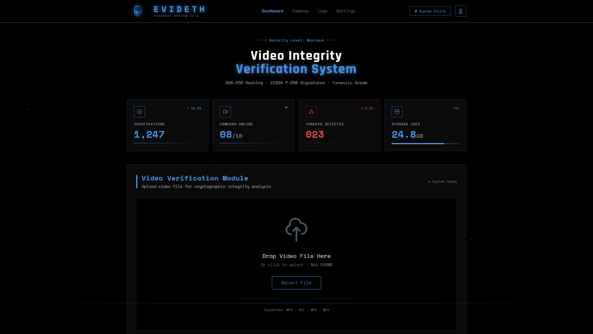

# EVIDETH
🔐 EVIDETH - Sistema Forense de Verificación de Integridad de Vídeo mediante hashing criptográfico (SHA-256) y firmas ECDSA.

<div align="center">
  

  # EVIDETH
  ### Sistema Forense de Verificación de Integridad de Vídeo

  **Hashing SHA-256 · Firmas ECDSA P-256 · Azure Cloud**

  <br/>

  

  <br/>

  <p>
    
    
    
  </p>
</div>

---

## 🚀 Acceso Rápido al Sistema

> El sistema está desplegado y operativo en **Microsoft Azure (Spain Central)**. Se puede acceder directamente desde el navegador sin necesidad de instalar nada.

### 🌐 URL del servidor

**[https://evideth-dev-backend.icywave-c2a647eb.spaincentral.azurecontainerapps.io](https://evideth-dev-backend.icywave-c2a647eb.spaincentral.azurecontainerapps.io)**

> La raíz (`/`) redirige automáticamente a la página de login.

---

### 🔑 Credenciales de administrador por defecto

El sistema crea automáticamente un usuario administrador al arrancar por primera vez:

| Campo | Valor |
|---|---|
| **Email** | `admin@evideth.com` |
| **Contraseña** | `Evideth@2026!` |
| **Rol** | Administrador |

> ⚠️ El sistema solicitará **cambiar la contraseña en el primer acceso** (`must_change_password = true`). Una vez cambiada, el acceso es completo.

---

### 📚 Documentación interactiva de la API (Swagger)

La documentación completa de todos los endpoints REST está disponible en:

**[https://evideth-dev-backend.icywave-c2a647eb.spaincentral.azurecontainerapps.io/docs](https://evideth-dev-backend.icywave-c2a647eb.spaincentral.azurecontainerapps.io/docs)**

---

## 🎯 Descripción General

EVIDETH es un sistema de verificación de integridad de vídeo de grado forense que garantiza la autenticidad e inalterabilidad de grabaciones de vigilancia mediante firmas criptográficas.

**Características principales:**
- 🔐 Verificación criptográfica en tres capas: SHA-256 (contenedor), árbol Merkle por segundo (L2) y firma ECDSA P-256 (L3)
- 📹 Segmentación de vídeo en bloques de 30 segundos para análisis granular
- ☁️ Integración con Azure Key Vault para gestión segura de claves
- 🦉 Inspirado en la sabiduría y vigilancia de Atenea

---

## 🖥️ Funcionamiento de la Aplicación Web

EVIDETH es una aplicación web completa compuesta por varias páginas especializadas. Todas comparten un diseño oscuro con estética forense (fuentes monoespaciadas, paleta azul-negro). A continuación se describe cada módulo:

### 🔑 Login / Registro

Punto de entrada a la aplicación. Los usuarios se autentican con usuario y contraseña; el sistema devuelve un **token JWT** que se almacena en el navegador y acompaña todas las peticiones posteriores. Existen dos roles:
- **Admin** — puede registrar cámaras, gestionar usuarios y ver todos los datos.
- **Analyst** — puede visualizar cámaras propias, consultar vídeos y lanzar verificaciones.

---

### 📊 Dashboard

Pantalla principal tras el login. Muestra una **visión global del estado del sistema** en tiempo real:

- Número total de cámaras registradas y cuántas están actualmente en línea.
- Estadísticas de segmentos: totales registrados, válidos e inválidos.
- Porcentaje de integridad global del sistema.
- Actividad reciente: últimos vídeos grabados y últimas alertas de manipulación.
- Accesos rápidos al resto de secciones.

---

### 📷 Gestión de Cámaras

Lista todas las cámaras registradas en el sistema con su estado (activa/inactiva, online/offline). Desde aquí el administrador puede:

- **Registrar** una nueva cámara (genera automáticamente su API Key).
- **Consultar el detalle** de una cámara: localización, última conexión, estadísticas de integridad.
- **Registrar la clave pública ECDSA** de la cámara (necesaria para la verificación de firma L3).
- **Desactivar** una cámara (los datos históricos se conservan para auditoría forense).
- Acceder directamente al **Live Viewer** de cada cámara.

---

### 🎥 Live Viewer (Visor en Directo)

El módulo más característico del sistema. Simula la grabación en directo de una cámara de vigilancia y registra cada segmento con su huella criptográfica en el backend.

**Cómo funciona paso a paso:**

1. **Configuración** — se introduce el *Camera ID* y la *API Key* de la cámara, la duración del segmento (10 / 30 / 60 s), el número máximo de segmentos y la URL del backend.
2. **Inicio de sesión de grabación** — al pulsar *START STREAMING*, el viewer crea un registro de vídeo en el backend (`POST /cameras/videos`) y empieza a capturar el canvas a 30 fps con la API `MediaRecorder`.
3. **Cierre de segmento** — cada N segundos, el blob WebM grabado se envía al servidor Docker local (`POST /save-segment`), que lo transcodifica a MP4 con ffmpeg y calcula:
   - **SHA-256** del fichero MP4 archivado.
   - **`second_hashes`**: hash SHA-256 de los píxeles RGB brutos de cada segundo (sin metadatos de contenedor).
   - **`merkle_root`**: raíz del árbol Merkle binario construido sobre los `second_hashes`.
4. **Registro en el backend** — los tres valores se envían al backend (`POST /cameras/segments`), que los persiste en PostgreSQL junto con la firma ECDSA si la cámara tiene clave registrada.
5. **Forensic Log** — el panel lateral derecho muestra todos los eventos con timestamp: guardado del fichero, raíz Merkle calculada, respuesta del backend y estado de integridad de cada segmento.
6. **Modo Tampering** — opción de simulación que envía un hash aleatorio (distinto al real) para alguno de los segmentos, demostrando que el sistema detecta la manipulación correctamente.
7. **Parada** — al pulsar *STOP* o al alcanzar el límite de segmentos, el viewer finaliza el vídeo en el backend (`PATCH /cameras/videos/{id}/finish`).

**Indicadores visuales en tiempo real:**
- 🔴 `REC` parpadeante mientras graba.
- Barra de progreso del segmento actual.
- Contador de segmentos válidos / inválidos.
- Porcentaje de integridad de la sesión.
- Timeline de segmentos con puntos azules (válido) o rojos (manipulado), clicables para ver el hash y la raíz Merkle de cada uno.

---

### 🔍 Módulo de Verificación

Permite a un analista **verificar la integridad forense de un vídeo archivado** subiendo el fichero MP4 desde su ordenador. El proceso de verificación opera en tres capas jerárquicas:

| Capa | Nombre | ¿Qué verifica? |
|---|---|---|
| **L1** | SHA-256 | Hash del fichero MP4 completo vs. el almacenado en BD |
| **L2** | Merkle Tree | Raíz Merkle de hashes por segundo vs. la almacenada en BD |
| **L3** | ECDSA P-256 | Firma digital de la cámara sobre el hash del segmento |

El resultado muestra para cada segmento si supera cada capa, indicando exactamente qué nivel falló y qué significa para la cadena de custodia. Si algún segmento falla, el sistema muestra el mensaje **"Tampering Detected"** con el detalle del segmento afectado. Si todo es correcto, muestra **"Integrity Verified"** y el vídeo puede ser admitido como evidencia forense.

Al final de la verificación se puede descargar un **informe PDF** con el resultado completo, los hashes y las firmas de cada segmento.

---

### 📋 Logs y Auditoría

Pantalla de consulta del registro de auditoría del sistema. Permite filtrar por cámara, rango de fechas, tipo de evento (registro de segmento, verificación, alerta de manipulación, login, etc.) y exportar los resultados. Todos los eventos están timestampeados con hora UTC y el ID del usuario o cámara que los originó.

---

## 📚 Documentación

### 🏗️ Infraestructura y Despliegue

| Documento | Descripción |
|---|---|
| [Pipeline CI/CD](docs/ci_cd_evideth.md) | Workflows de GitHub Actions: build, deploy, destroy y plan. Autenticación OIDC con Azure. |
| [Azure Key Vault](docs/azure_key_vault.md) | Gestión de la clave ECDSA P-256 y secretos desde Key Vault. Managed Identity. |
| [Application Insights](docs/application_insights.md) | Telemetría, trazas y métricas del backend en Azure Monitor. |
| [Logging y Observabilidad](docs/logging_y_observabilidad.md) | Estructura de logs, niveles, correlación de trazas y Log Analytics Workspace. |

### 🔐 Seguridad e Identidades

| Documento | Descripción |
|---|---|
| [Gestión de Identidades](docs/gestion_identidades.md) | JWT para usuarios, API Keys para cámaras, roles y control de acceso. |
| [Seguridad de Datos y Credenciales](docs/seguridad_datos_y_credenciales.md) | Cifrado en tránsito y en reposo, gestión de secretos y modelo de amenazas. |

### 🧪 Testing

| Documento | Descripción |
|---|---|
| [Tests Unitarios y Escenarios](docs/tests_unitarios_y_escenarios.md) | Cobertura de tests unitarios, fixtures y escenarios de prueba por módulo. |
| [Tests de Integración](docs/tests_integracion.md) | Tests end-to-end contra la API real, base de datos y servicios Azure. |

### 🎨 Diseños

| Recurso | Descripción |
|---|---|
| [Diagrama de Arquitectura (PDF)](docs/Designs/Schemes/InfraestructuraAzure.pdf) | Arquitectura completa de infraestructura Azure. |
| [Carpeta Designs](docs/Designs/) | Diagramas, esquemas y mockups del sistema. |

---

## ☁️ Infraestructura Azure

EVIDETH está desplegado en **Microsoft Azure** (Spain Central) con una arquitectura privada y orientada a la seguridad. Todos los recursos se encuentran en el grupo de recursos `evideth-dev-rg`.

### Visión General de la Arquitectura

| Capa | Recurso | Función |
|---|---|---|
| **Red** | `capp-svc-lb` + `capp-svc-lb-ip` | Balanceador de carga público e IP de entrada |
| **Red** | `evideth-dev-app-nsg` | Grupo de seguridad de red — reglas de tráfico |
| **Red** | `evideth-dev-vnet` | Red virtual con subnets de aplicación y datos |
| **Cómputo** | `evideth-dev-backend` (Container App) | Backend FastAPI + frontend estático |
| **Cómputo** | `evideth-dev-cae` | Entorno de Container Apps |
| **Registro** | `evidethdevacr94f04b.azurecr.io` | Registro de imágenes Docker (pipeline CI/CD) |
| **Base de datos** | `evideth-dev-pgserver` | PostgreSQL Flexible Server — **solo acceso privado por VNet** |
| **Base de datos** | `evideth.postgres.database.azure.com` | Zona DNS privada para PostgreSQL |
| **Seguridad** | `evideth-dev-kv-94f04b` | Key Vault — clave ECDSA P-256 + secreto JWT |
| **Almacenamiento** | `evidethdevst94f04b` | Blob Storage — vídeos subidos por analistas para verificación |
| **Observabilidad** | `evideth-dev-logs` | Área de trabajo de Log Analytics |

### Decisiones de Seguridad Clave

- **PostgreSQL sin endpoint público** — accesible únicamente dentro de la VNet mediante zona DNS privada.
- **Acceso a Key Vault mediante Managed Identity** — sin credenciales almacenadas en el código ni en variables de entorno.
- **CI/CD con OIDC** — GitHub Actions se autentica en Azure mediante Workload Identity Federation; sin secretos de larga duración en GitHub.
- **JWT para usuarios, API Keys para cámaras** — mecanismos de autenticación independientes según el tipo de cliente.

### Flujo CI/CD

```
GitHub Push → GitHub Actions (OIDC) → Terraform Apply (infra)
  → Build imagen Docker → Push al ACR → Container App actualizado
```

### Flujo de Petición

```
Cámara (API Key) ──► Balanceador de carga ──► Container App
                                                    │
                               ┌────────────────────┼────────────────────┐
                               ▼                    ▼                    ▼
                          Key Vault           PostgreSQL           Blob Storage
                        (clave ECDSA)     (hashes + firmas)    (MP4 de analistas)
```

📄 **[Diagrama de Arquitectura Completo (PDF)](docs/Designs/Schemes/InfraestructuraAzure.pdf)**

---

## 📷 Despliegue del Cliente (Live Viewer)

El cliente EVIDETH es un **simulador de cámara forense** que renderiza vídeo sintético en el navegador (via `<canvas>`), genera hashes SHA-256 reales del blob WebM de cada segmento y los envía al backend para su registro criptográfico. El servidor Python transcodifica cada segmento de WebM a MP4 (H.264) con ffmpeg, calcula la raíz Merkle sobre los frames y guarda el fichero localmente en `./VIDEOS/`.

> 🔐 **Cadena de integridad forense:**
> El SHA-256, `second_hashes` y `merkle_root` se calculan en el servidor Docker sobre el **MP4 archivado final** (el mismo fichero que el analista subirá para verificar), garantizando que los valores almacenados en BD coincidan exactamente con los recalculados durante la verificación.
> El backend **no almacena el vídeo** — solo persiste en PostgreSQL los hashes SHA-256, raíces Merkle, firmas ECDSA y metadatos de cada segmento.

### Prerrequisitos

- [Docker Desktop](https://www.docker.com/products/docker-desktop/) instalado y en ejecución
- Acceso al backend EVIDETH (Azure o local)
- **Camera ID** y **API Key** de una cámara registrada en el sistema

> 💡 Si no tienes una cámara registrada, un administrador debe crearla primero en el panel de administración o mediante `POST /api/v1/cameras/` con rol Admin.

---

### ⚙️ Paso 1 — Configurar credenciales

Edita el fichero `frontend/client.config.js` con los datos de tu cámara:

```js
// frontend/client.config.js
window.EVIDETH_CONFIG = {
  CAMERA_ID:      'CAM1',                          // ID de la cámara registrada
  CAMERA_API_KEY: 'evideth_cam_XXXXXXXXXXXX',       // API Key obtenida al registrar la cámara
  BACKEND_URL:    'https://evideth-dev-backend.icywave-c2a647eb.spaincentral.azurecontainerapps.io',
  MAX_SEGMENTS:   0,                               // 0 = sin límite · N = para automáticamente al llegar a N
};
```

| Parámetro | Descripción | Ejemplo |
|---|---|---|
| `CAMERA_ID` | Identificador único de la cámara | `CAM1`, `CAM-LOBBY-01` |
| `CAMERA_API_KEY` | API Key generada al registrar la cámara | `evideth_cam_abc123...` |
| `BACKEND_URL` | URL base del backend (sin barra final) | URL de Azure o `http://localhost:8000` |
| `MAX_SEGMENTS` | Nº de segmentos a grabar antes de parar | `0` = infinito, `5` = para tras 5 segmentos |

---

### 🚀 Paso 2 — Levantar el cliente

Desde la raíz del repositorio:

```bash
git pull
docker compose -f docker-compose.client.yml up --build
```

> Si ya existe un contenedor previo con el mismo nombre:
> ```bash
> docker rm -f evideth-client
> docker compose -f docker-compose.client.yml up --build
> ```

---

### 🎬 Paso 3 — Abrir el Live Viewer

Una vez el contenedor esté en marcha, abre el navegador en:

```
http://localhost:8080/
```

> La raíz redirige automáticamente al Live Viewer.

---

### 🛠️ Paso 4 — Usar el Live Viewer

1. **Verifica la configuración** — la barra superior mostrará ✅ `Config loaded from client.config.js` si las credenciales están correctamente cargadas.
2. **Ajusta los parámetros** si necesitas cambiarlos en tiempo real (sin reiniciar Docker):
   - *Camera ID* y *API Key*
   - *Segment Duration*: 10s, 30s o 60s
   - *Nº Segments*: número de segmentos a registrar (vacío = sin límite)
   - *Simulate Tampering*: activa para que algunos segmentos se envíen con un hash alterado (modo demo/testing de detección de manipulación)
3. **Pulsa START STREAMING** — el cliente:
   - Crea un registro de vídeo en el backend (`POST /api/v1/cameras/videos`) — solo metadatos, sin fichero
   - Cada N segundos envía el blob WebM al servidor Docker, que transcodifica a MP4 y calcula SHA-256 + Merkle root
   - Registra el segmento en el backend con los tres valores criptográficos (`POST /api/v1/cameras/segments`)
   - El servidor guarda el segmento como `.mp4` en `./VIDEOS/<CAMERA_ID>/<VIDEO_ID>/`
   - Para automáticamente si se alcanza el límite de segmentos
   - Cierra el registro de vídeo en el backend al parar (`PATCH /api/v1/cameras/videos/{id}/finish`)
4. **Consulta el Forensic Log** — panel derecho con todos los eventos timestampeados.
5. **Pulsa VERIFY ALL** (tras parar) para re-verificar los hashes almacenados contra los del backend.

---

### 🔗 Flujo de Comunicación con el Backend

```
[CLIENTE] START STREAMING
    │
    ├─► POST /api/v1/cameras/videos
    │       { filename: "camera_CAM1_2026-06-02T...mp4" }   ← solo nombre, sin fichero
    │   ◄── { id: "3f7a1c2d-..." }  ← video_id
    │
    │   (cada N segundos)
    ├─► POST /save-segment  (servidor local Docker)
    │       multipart: blob WebM → ffmpeg → seg_NNN.mp4
    │       calcula SHA-256 + second_hashes + merkle_root sobre el MP4
    │       guardado en ./VIDEOS/<CAM_ID>/<VIDEO_ID>/
    │
    ├─► POST /api/v1/cameras/segments
    │       { video_id, segment_index, start_time_secs,
    │         end_time_secs, sha256_hash,
    │         merkle_root, second_hashes }                  ← datos criptográficos L1 + L2
    │   ◄── { id, status: "PENDING" | "VALID" }
    │
    ├─► POST /api/v1/cameras/heartbeat   (al iniciar)
    │
[CLIENTE] STOP / límite alcanzado
    │
    └─► PATCH /api/v1/cameras/videos/{video_id}/finish
```

Todas las peticiones al backend incluyen la cabecera `X-API-Key: <tu_api_key>` para autenticar la cámara.

---

### 🛠️ Conectar contra backend local (desarrollo)

Si tienes el backend corriendo en local (puerto 8000), cambia `BACKEND_URL` en `client.config.js`:

```js
BACKEND_URL: 'http://host.docker.internal:8000',
```

> En Linux usa `http://172.17.0.1:8000` si `host.docker.internal` no resuelve.

---

### ❗ Solución de Problemas Frecuentes

| Síntoma | Causa | Solución |
|---|---|---|
| Pantalla en blanco en `http://localhost:8080/` | Nginx no arrancó | `docker logs evideth-client` para ver el error |
| `Config loaded but CAMERA_ID is empty` | `client.config.js` sin rellenar | Editar el fichero y refrescar el navegador |
| `Video creation failed: HTTP 401` | API Key incorrecta o caducada | Verificar la API Key en el panel de administración |
| `Video creation failed: HTTP 403` | Cámara inactiva | Activar la cámara desde el panel Admin |
| `Seg #N · Backend: 404` | `video_id` no válido o cámara no encontrada | Comprobar que la cámara existe y el `CAMERA_ID` es correcto |
| `Seg #N · Backend: 409` | Segmento duplicado (mismo índice ya registrado) | Pulsar **Reset** antes de iniciar una nueva sesión |
| `Heartbeat failed` | Backend no accesible desde Docker | Verificar `BACKEND_URL` y conectividad de red |
| `ffmpeg: false` en `/health` | Imagen antigua sin ffmpeg | `docker compose -f docker-compose.client.yml up --build` |
| Error de nombre de contenedor en uso | Contenedor previo sin eliminar | `docker rm -f evideth-client` |
| `⚠ No merkle_root returned` en el log | Docker no rebuildeado tras último fix | `docker compose -f docker-compose.client.yml up --build` |
